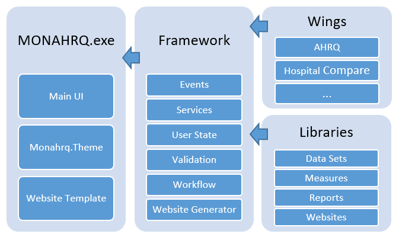

# MONAHRQ-Full-Code

## What is MONAHRQ?

MONAHRQ is a desktop software tool that enables organizations, such as state and local data organizations, regional reporting collaborations, hospitals and hospital systems, nursing homes and nursing home organizations, and health plans to quickly and easily create a health care reporting Web site. MONAHRQ analyzes, summarizes, and presents the following information in a format ready for use and easily usable by consumers and other health care decision makers on:
* Quality of care (at the Hospital level).
* Quality of care (at the Nursing Home level).
* Physician data and quality reporting at the Medical Group level.
* Side by Side Comparison Report.
* Health care utilization (at the Hospital level and Emergency Department level).
* Preventable hospitalizations (at the Area level).
* Rates of conditions and procedures (at the Area level).
* Estimated costs and cost-savings (related to the quality of care).

MONAHRQ enables you to create a Website using publically available data, such as, inpatient and outpatient measures from Hospitals. It enables you to compare long term and short term stays measures from CMS Nursing Home and compare CMS physician compare data. MONHARQ also enables you to import your own inpatient discharge data, emergency department data, pre-calculated AHRQ Quality Indicators results, and/or CAHPS survey measures for Nursing Home and Clinician & Group CAHPS Survey (CG-CAHPS) data and Healthcare Effectiveness report. 

Organizations can use MONAHRQ to generate a reporting Web site by simply:

* Downloading MONAHRQ software.
* Loading your data.
* Selecting Web site options.
* Generating the Web site on your own computer.
* Hosting the Web site yourself.

## What is the MONAHRQ Open Source Project? 

The highly dynamic health care environment driven by the Affordable Care Act, and other changes in federal law, provides an opportunity for MONAHRQ to become a software tool that significantly expands transparency while driving innovation and collaborative development. The new architecture of MONAHRQ can be leveraged to accelerate the adoption of the software as a quality reporting solution for both internal quality improvement, as well as public reporting requirements.

With the release of MONAHRQ as an open source project, it will be possible for developers to extend the MONAHRQ application to add new data sources, measures, reporting options, and website customization capabilities. This enables the open source developer community to extend MONAHRQ to create new plug-ins for additional reporting in the future. 

MONAHRQ 7.0 architecture is based on a modular designed and that combined with open source framework (https://github.com/AHRQ/MONAHRQ-Framework ) makes it easy for developers to extend functionality to meet their needs. Opening MONAHRQ source code is the first step in enabling innovation and greater flexibility for Host Users. Users who have experience with software development or basic programming skills should be able to apply the information described below to add new datasets and create new report types for their MONAHRQ-generated website. Host Users who are not familiar with programming and related technical issues are encouraged to team with an IT professional or developer who can assist them with the development.

## Who uses MOANHRQ? 
MONAHRQ can be used by organizations, such as state and local data organizations, regional reporting collaborations, hospitals and hospital systems, nursing homes and nursing home organizations, and health plans. MONAHRQ is extensible and can include measures and reports necessary to build a website most suited to the target audience. The two types of End User audiences for MONAHRQ are:
* Consumers: Consumers of health care include the general public, patients, and caretakers.  
* Health Care Professionals: “Health Care Professionals” includes providers (e.g., hospitals, physician groups, nursing homes), researchers, analysts, health plan purchasers, employers and policymakers. 

The following link is a guide to help Host Users or organizations who wish to download MONAHRQ and generate reports decide what type of reporting website to create -  [monahrq-v7-decisionguide.pdf](Documents/monahrq-v7-decisionguide.pdf) 

## What hardware or other platform MONAHRQ runs on?
MONAHRQ runs on both 32-bit and 64-bit Microsoft Windows operating systems. MONAHRQ is also supported on the following operating systems: Windows Server 2003 or higher 32- and 64-bit; 
* Windows 7 32- and 64-bit; 
* Windows 8 32- and 64-bit; 
* Windows 10 32- and 64-bit. 
* Windows Server 2003/2008/2012/2016, 32 and 64-bit

MONAHRQ requires the Microsoft® .NET Framework 4.5, which can be downloaded at the Microsoft website - http://www.microsoft.com/enus/download/details.aspx?id=30653. 
MONAHRQ also requires the user and developers to install Microsoft SQL Server® 2008 or 2012 or the free SQL Server Express 2008 or 2012.

## How to install the MONAHRQ software?
For instructions on how to install MONAHRQ, refer to: [MONAHRQ_Installation_Guide.pdf](Documents/MONAHRQ_Installation_Guide.pdf)

## How to get the source code?
The source code can be downloaded from the GitHub website (add the link here)

## How is the code organized?
The following schematic depicts how the MONAHRQ source code is organized. The source code is organized into four major categories:

**Wings:** A “Wing” is defined as a modular interface for the MONAHRQ software that enables Host Users to import new data files into MONAHRQ. There are several types of Wings used by MONAHRQ. Each Wing can handle a discrete dataset type. Several Wings can be used throughout the process of preparing and publishing a MONAHRQ-generated website.

**Libraries:** In MONAHRQ, a library is a collection of items defined in a Wing, often used in creating the reports. These libraries include collection of Data set, Measures, Reports and Websites. 

**Framework:** This is the core of MONAHRQ where the business logic is contained which is not otherwise self-defined by a Wing. 

**MONAHRQ.exe:** This is responsible for the initialization of the MONAHRQ application. This gives you more control on how the various MONAHRQ components are connected to the application.

## What do I need to know to maintenance MONAHRQ in the future?
The Sustainability Guide (Guide) outlines the processes by which current and future users of the MONAHRQ software (Host Users) can maintain and update the measures, included data sources, and content of their MONAHRQ-generated website. For details, refer to the following document: [MONAHRQ Maintenance Guide](https://www.ahrq.gov/downloads/monahrq/documentation/monahrq_sustainability_guide.pdf)

## What are the License requirements?
For the Open Source license document refer to: [this document](Documents/MONAHRQFullCodeOpenSourceLicense.pdf)  

## How do I use the application?
Host Users and Developers can get informed on how the MONAHRQ application works by referring to the Host User guide here: http://www.ahrq.gov/downloads/monahrq/documentation/monahrq-v7-hostuserguide.pdf .

In addition, various MONAHRQ presentations that may guide you in your understanding of MONAHRQ can be found here: https://www.ahrq.gov/professionals/systems/monahrq/resources/index.html#Presentations

## Developers 
The technical details of the open source project can be found in Wiki section of this repository. 

	
